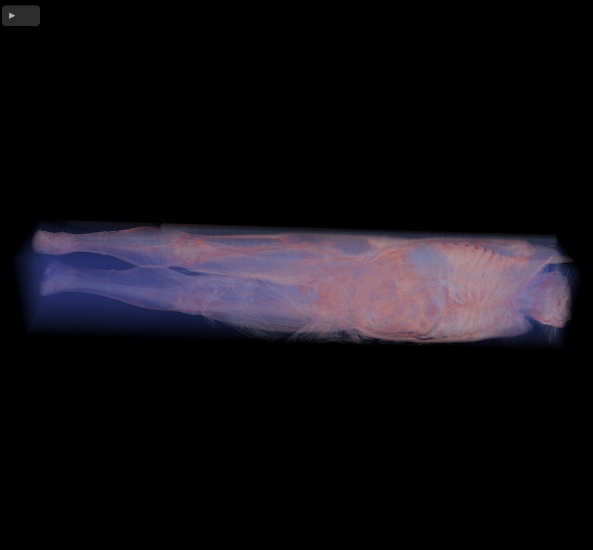

# A Direct Volume Renderer for DiffDVR

This code project represents part of my thesis "Differentiable Volume Rendering for Novel View Synthesis"
that I wrote for my Bachelor's thesis at TU Munich.

This renderer is a volumetric raymarcher that can load and display various volumetric model
and quickly export multiple views of the volume for application in Novel View Synthesis.

## Features
- Load Volumes in a DAT or NetCDF-Format
- Export views in PNG-format
- Configurable amount of views to be generated
- Simple Transfer-Functions to add colors to volumes

## Controls
Use WASD to move around the object. When exporting views, first disable "Free Move" in the GUI and select
the amount of views to be exported using the two top sliders. Move the position sliders to the left and press 
"Export all views" to automatically move the camera around the volume. Screenshots will be exported in a 
"screenshots" folder.

## Addiontal Scripts
The project comes with a sample DiffDVR script for configurating the optimization process. DiffDVR by Sebastian Weiss
is needed to run this script. Secondly, a simple script for comparing views with the same filename and calculating the average RMSE
across all views.

## Running
It is recommended to build/run the renderer with the release flag for optimized performance.
Use: `cargo build --release` or `cargo run --release`

## Hardware requirements

The renderer requires GPUs that can load large three-dimensional textures up to a depth of 4096 pixels.
If the process crashes on launch, the limits of the three-dimensional texture depth can be reduced in src/state.rs:59 by
reducing the maximal 3d texture dimension to 2048. This has the effect, that very large volumes cannot be loaded anymore.